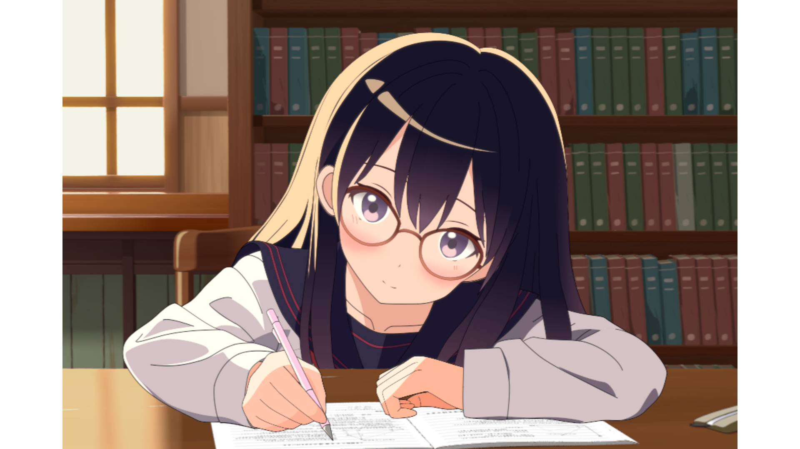
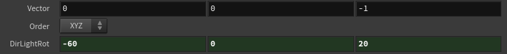
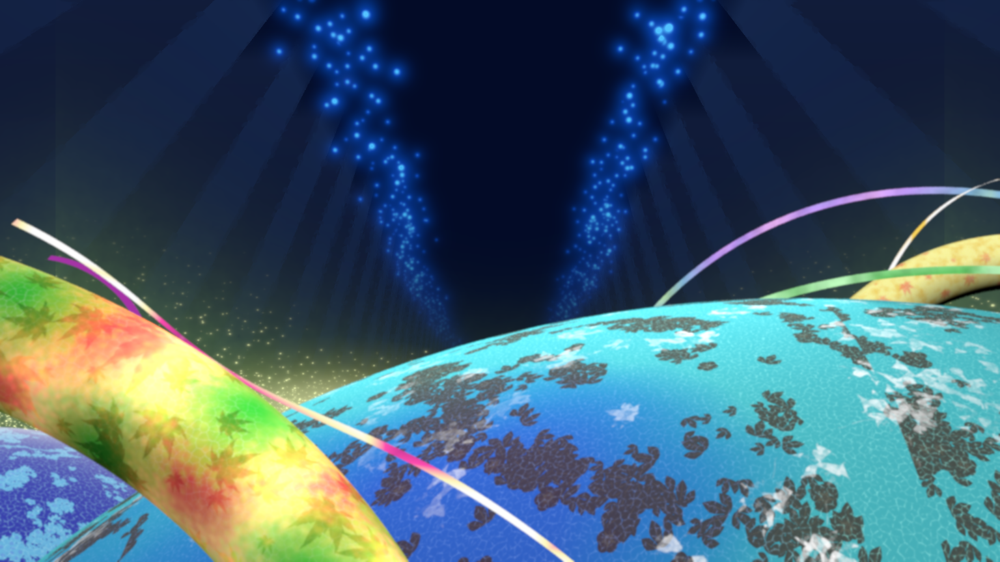
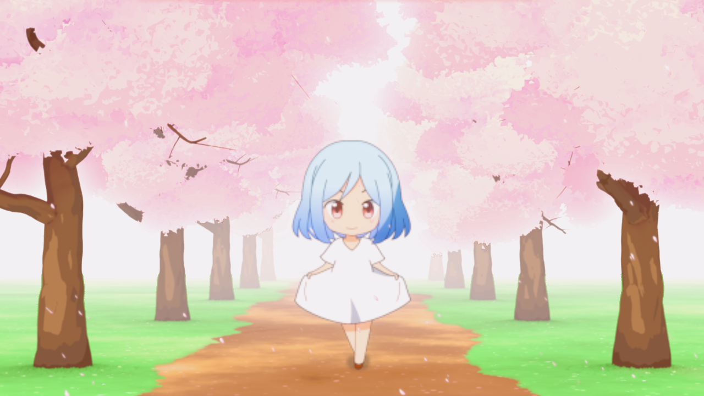
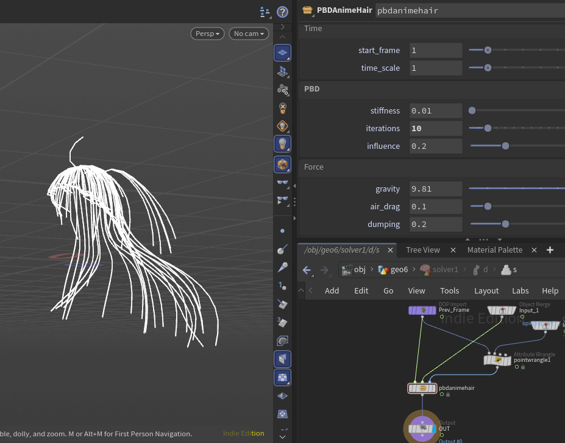
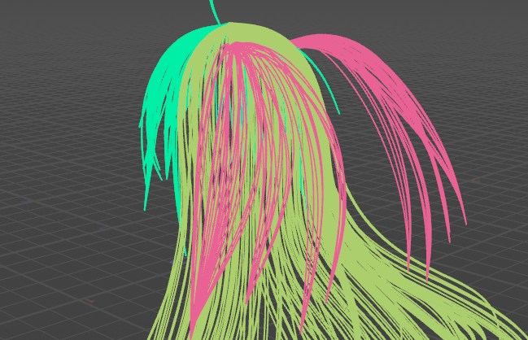

# 自分用HoudiniDigitalAsset(HDA)集
プロジェクト共通で作ったつもりのHDAが行方不明になりがちなので、まとめて管理することにしました。

## CreateBookLine
棚にランダムに本を並べる。

## WALL_GENERATOR
石積みの壁を生成する。

## FLUSH_GEN
COPsでウニフラを作るやつ。

## DIR_LIGHT_VEC

Distant(Directional)Lightのベクトルを出す。

/objでDistantLightを作ってRotationのパラメータを設定しておき、マテリアル内のこのHDAのDirLightRotににリファレンスコピーして使う。

## JITTER_CURVE
なんで作ったのか忘れた……

そのうち思い出したら書く。

## SpecularForMatX
MatXでオレオレスペキュラ計算

## LEAF_CREATOR
球形の中にボリュームで葉っぱっぽいものを生成する

主に中遠景用

## PBDAnimeHair
髪の毛用のCurveをPBDベースで動かす。

f@curveuとf@pinの設定が事前に必要で、入力されたRESTポーズをGravityとして適用するので揺れながらRESTポーズに収束していく。

p@fixed_pos/p@force(wはウェイト)ポイントアトリビュートで当たり判定後座標や追加Forceを設定できる。

## HairScatter

髪の毛をSweepする代わりにSweep形状の範囲でScatterする。

ガイドの入力CurveごとにPrimtiveのAttributeにi@sweep_indexを付けておくことで、Scatterで使う形状を選択できる。

